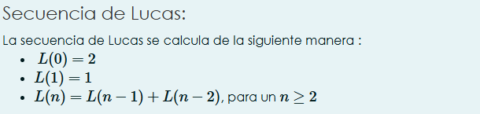
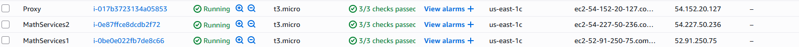
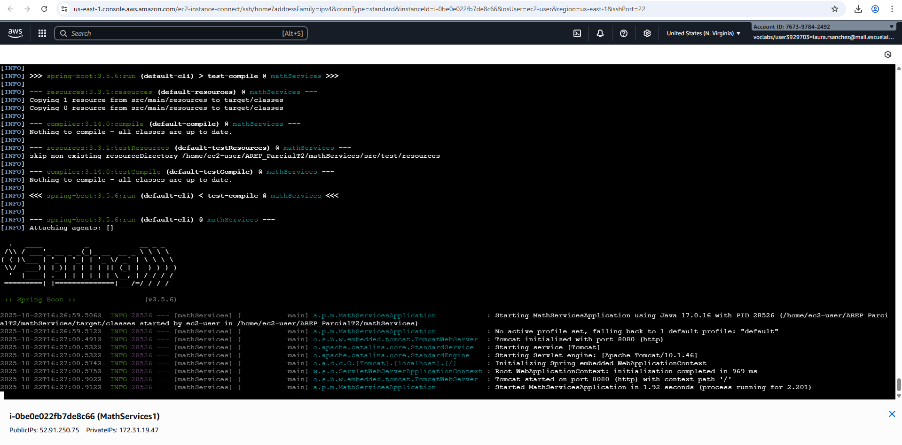
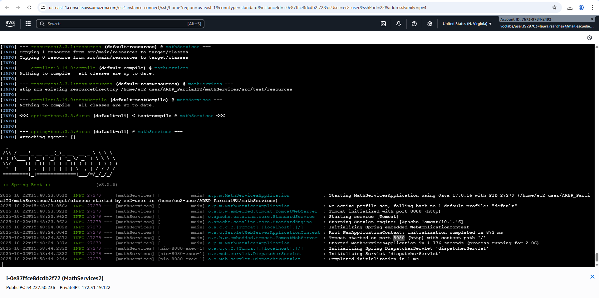
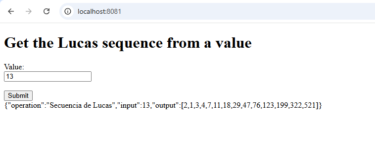
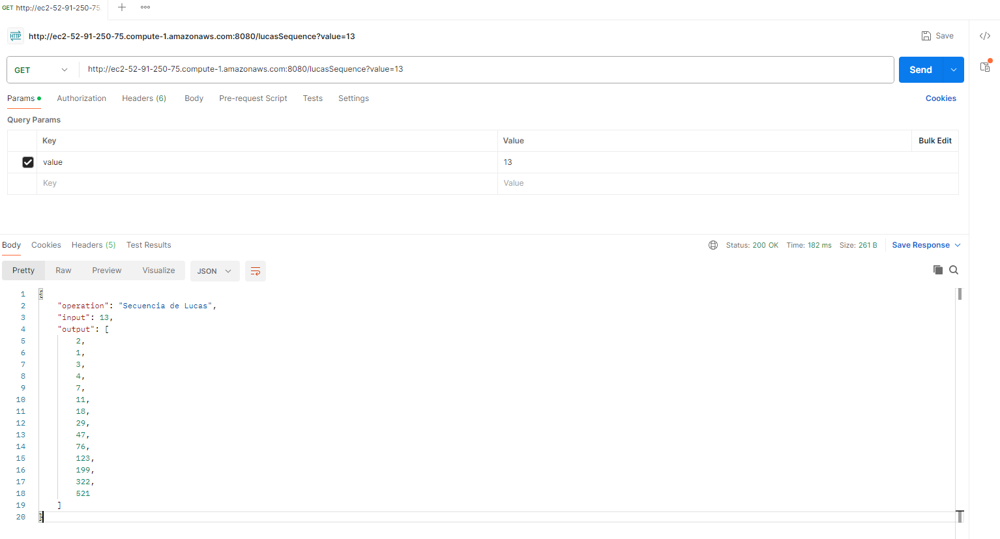
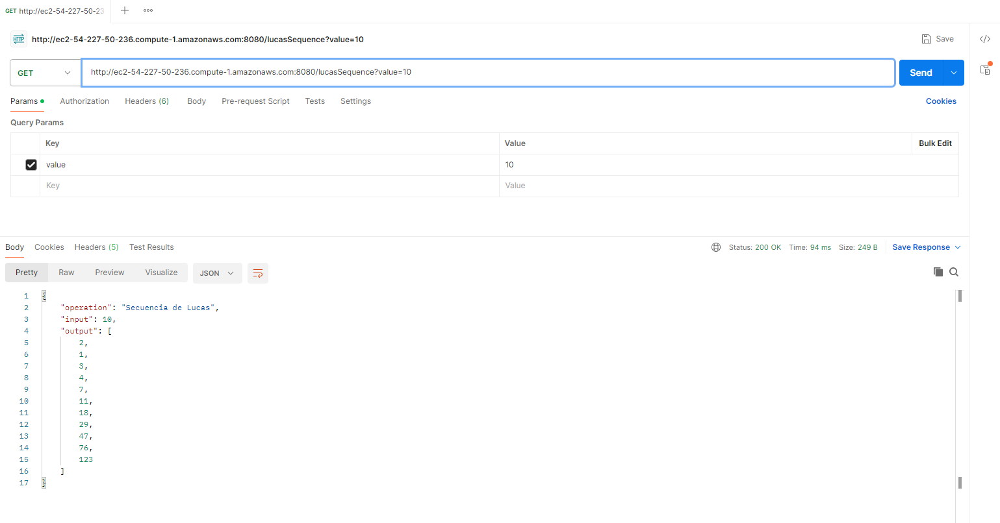
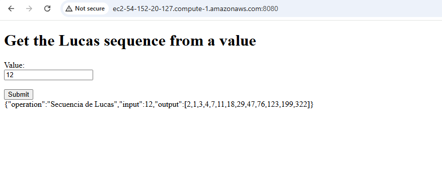

# AREP Parcial Segundo Tercio

## Problema
En este pacial se busca resolver la secuencia de Lucas:



Para ello se implemento el Math Services la siguiente lógica:

````java
    public static List<Integer> lucasSequence(Integer value){
        List<Integer> sequence = new ArrayList<>();

        int count = 0;
        while (count <= value){
            sequence.add(lucasSequenceRec(count));
            count = count + 1;
        }
        return sequence;
    }

    private static Integer lucasSequenceRec(Integer value){
        int count = 0;
        if (value == 0){
            return 2;
        }else if (value == 1){
            return 1;
        }else{
            return lucasSequenceRec(value-1) + lucasSequenceRec(value-2);
        }
    }
````

## Ejecución

Ejecute:

 ````bash
 git clone https://github.com/LauraRo166/AREP_ParcialT2.git
 cd AREP_ParcialT2
 ````
Ejecute Math Services:

 ````bash
 cd mathServices
 mvn spring-boot:run
 ````

Se recomienda cambiar el puerto en el proxy para ejecutar ambos de manera local.
Para ello en `application.properties` agregue:
````
server.port=8081
````

Además, en `ProxyController.java` en el método `selectMachine()` cambie las siguientes
líneas por las URL que va a utiliar.
````java
String URL1 = "http://ec2-52-91-250-75.compute-1.amazonaws.com:8080/lucasSequence?value=" + newValue;
String URL2 = "http://ec2-54-227-50-236.compute-1.amazonaws.com:8080/lucasSequence?value=" + newValue;
````
**Nota:** Solo cambie la parte de  `ec2-52-91-250-75.compute-1.amazonaws.com` y el puerto su lo ve necesario.

Ahora, ejecute el Proxy:
 ````bash
 cd proxy
 mvn spring-boot:run
 ````

## Despliegue

Cree 3 instancias en AWS, por ejemplo:



**Nota:** No olvide habilitar en el grupo de seguridad los puertos `22`, `8080` y para todo tráfico.

En cada una de las instancias ejecute:

````bash
sudo yum install java-17-amazon-corretto-headless git maven
git clone https://github.com/LauraRo166/AREP_ParcialT2.git
cd AREP_ParcialT2
````
**Nota:** Para este paso debe tener su repositorio listo con los cambios necesarios (URL o puertos) para ejecutar en las instancias. 

En las instancias de Math Services:
 ````bash
 cd mathServices
 ./mvnw clean install
 ./mvnw spring-boot:run
 ````
Debe observar lo siguiente:

- MathServices1


- MathServices2



En las instacia del proxy:
 ````bash
 cd proxy
 ./mvnw clean install
 ./mvnw spring-boot:run
 ````
## Pruebas
### Local
Prueba mathServices en local (con Postman):
**URL:** http://localhost:8080/lucasSequence?value=13


Prueba proxy en local (con el navegador):
**URL:** http://localhost:8081



### Despliegue

Prueba mathServices desde la instancia MathServices1 (con Postman):
**URL:** http://ec2-52-91-250-75.compute-1.amazonaws.com:8080/lucasSequence?value=13


Prueba mathServices desde la instancia MathServices2 (con Postman):
**URL:** http://ec2-54-227-50-236.compute-1.amazonaws.com:8080/lucasSequence?value=10


Prueba proxy (con el navegador):



Se comprueba el correcto funcionamiento del despligue con el video `ParcialArep2.mp4` el cual
se encuentra en la raiz de este repositorio.


